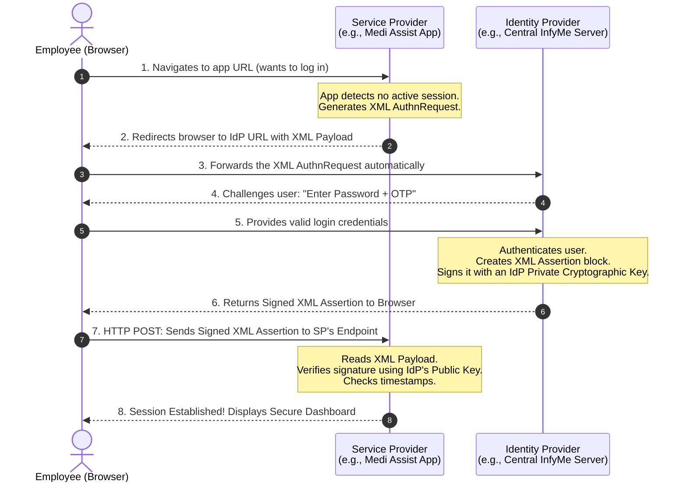
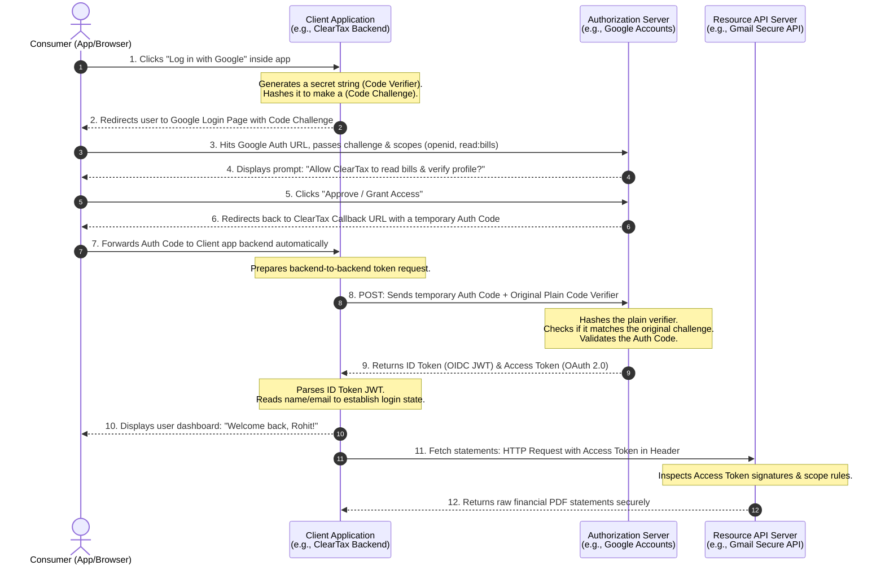

# The Ultimate Student-Friendly Guide to Identity Architecture
### Demystifying SAML 2.0, OAuth 2.0, and OpenID Connect (OIDC) with Real-World Analogies and UML Flows
---
## 📑 Core Concepts: The Golden Rule of Identity
Before looking at any code or protocols, you must understand the difference between **Authentication** and **Authorization**. Missing this distinction is where most engineering students get confused!
*   **Authentication (AuthN) = "Who are you?"**  
    *Proven by:* Your fingerprint, face ID, username/password, or an OTP sent to your phone.
    *Goal:* To verify your identity claim beyond doubt.
*   **Authorization (AuthZ) = "What are you allowed to do?"**  
    *Proven by:* A wristband at a music festival, a movie ticket stub, or a key card.
    *Goal:* Checking permissions *after* we already know you are a valid user.
### At-a-Glance Matrix
| Protocol | Purpose | Analogy | Data Style |
| :--- | :--- | :--- | :--- |
| **SAML 2.0** | Authentication (Enterprise) | Corporate ID Card | XML (Heavy & Verbose) |
| **OAuth 2.0** | Authorization (API Access) | Hotel Room Key Card | Opaque String / JSON |
| **OIDC** | Authentication (Modern App Login)| DigiLocker Profile | JWT (Lightweight JSON) |
---
## 1. SAML 2.0 (Security Assertion Markup Language)
### The Real-World Analogy Imagine you work in a massive tech park in Bengaluru (like Manyata Tech Park). You enter through the main security gate. The central security desk checks your Aadhaar card and biometrics (**Identity Provider / IdP**). Instead of making you type your password at every single building inside, they hand you a stamped, tamper-proof corporate entry pass (**SAML Assertion**). 

When you go to the cafeteria or the gym building (**Service Provider / SP**), the guard at the door doesn't ask for your password. They look at the stamp, check the signature, and let you in.

### 🏢 Real Indian Scenarios*   
**Infosys/TCS Employee Portal:**
 An engineer logs into **InfyMe** or **Ultimatix** once. When they click a link to view their health insurance provider (**Medi Assist**) or check their **Provident Fund (PF)** dashboard, they are logged in automatically without entering another password.*  
**State Bank of India (SBI) Internal Tools:** 
 A branch officer logs into the core banking terminal. When they need to verify a business's tax status on the internal **Income Tax Department Portal**, a SAML link securely passes their pre-authenticated banking identity directly to the government portal.
### 📊 UML Sequence Diagram: SAML 2.0 Flow
*This diagram displays the Service Provider-Initiated (SP-Initiated) flow, which triggers when a user tries to access a corporate app directly.*

### Deep Dive: Detailed Step Breakdown1.  **The Request:** The user hits `://mediassist.com`. The application checks its memory and says, *"I don't know who this is."*
2.  **The Redirect:** The application generates a massive block of formatted text written in **XML** called a `<samlp:AuthnRequest>`. It passes this block to the user's browser alongside a command telling the browser to jump immediately over to the central corporate login server.3.  **The Authentication:** The central corporate server displays a screen asking for username, password, and Microsoft Authenticator approval.4.  **The Token Generation:** Once verified, the server creates a large XML document called a **SAML Assertion**. This document states explicitly: *"This user is Rahul Sharma, their email is rahul@infosys.com, and they belong to the Dev-Team."* The server uses a hidden **Private Cryptographic Key** to sign the text, making it impossible to forge.5.  **The Post & Verification:** The browser forwards this signed XML token to the app. The app uses a matching **Public Cryptographic Key** (shared beforehand) to verify the signature. If the mathematical signature checks out, the user is instantly granted a secure session.
---## 2. OAuth 2.0 (The Authorization Framework)### The Real-World AnalogyImagine you check into a luxury hotel in Goa. You show your passport at the front desk (Authentication). The receptionist does not give you a copy of the hotel's master keys or your passport back to unlock doors. Instead, they hand you a plastic **Electronic Key Card** (**Access Token**). 

The key card doesn't say your name or list your home address. It contains a hidden electronic signature that tells the elevator door or your room lock (**Resource Server / API**): *"Allow whoever holds this card to unlock Room 305 until Friday noon."*
### 📱 Real Indian Scenarios*   **Cred Scanning Your Bills:** You want the **Cred** app to track your credit card bills automatically. Cred prompts you to link your Google account. Google displays a screen asking: *"Do you allow Cred to read emails matching your bank name?"* When you hit allow, Google passes Cred a limited **Access Token**. Cred can read your statements, but it **never** sees or knows your Google password.*   **Canva Pulling Instagram Assets:** When designing graphics on **Canva**, you can connect your **Instagram** library to drop in photos. Instagram issues an OAuth token to Canva allowing read-only access to your photo gallery API while keeping your account credentials entirely safe.
---## 3. OpenID Connect (OIDC)### The Real-World AnalogyOAuth 2.0 was designed *strictly* for access cards, not for user identity. It tells a door to unlock, but it doesn't tell the door *who* unlocked it. 

To fix this, engineers built **OIDC** directly on top of OAuth 2.0. Think of OIDC as attaching a **DigiLocker Identity Profile** right next to your access card. Now, when you present your token, you get an access pass (**Access Token**) alongside a clear, digitally signed identity slip (**ID Token**) containing your verified profile picture, full name, and email address.
### 📱 Real Indian Scenarios*   **Swiggy / Zomato Express Registration:** You open **Swiggy** for the first time and tap **"Continue with Google"**. Google validates your smartphone's biometric face lock and hands Swiggy an identity token (**ID Token**). Swiggy instantly reads your verified name and email to set up your profile without requiring a new registration form.*   **ClearTax Login Integration:** Instead of generating and memorizing a complex password for tax preparation tools like **ClearTax**, you choose **"Log in with Microsoft/Google"**. The provider signs you in securely and transmits your verified enterprise identity profile straight to ClearTax.
---## 🔄 The Modern Master Flow: OIDC + OAuth 2.0 with PKCE
Modern mobile and frontend web apps use a highly secure workflow called the **Authorization Code Flow with PKCE** (Proof Key for Code Exchange). It prevents hackers from hijacking intermediate tokens mid-air.
### 📊 UML Sequence Diagram: Combined OIDC & OAuth 2.0 Flow

### Technical Step Breakdown for Students


   1. The Setup (PKCE Injection): The client app sets up a trap for hackers. It creates a secret random value called a Code Verifier (e.g., my_secret_string_123). It runs a SHA-256 mathematical hash function over it to create a scrambled version called the Code Challenge.
   2. The Scoped Request: The app sends the user to Google. It includes the Code Challenge and requests explicit Scopes. Scopes are configuration requests defining what data it wants:
   * openid and profile $\rightarrow$ (tells the system to use the OIDC identity layer).
      * read:bills $\rightarrow$ (tells the system to use the OAuth authorization layer for API access).
   3. The Consent & Auth Code: The user logs in and consents. Google creates a temporary puzzle piece called an Authorization Code and forwards it to the browser callback. This code is useless on its own; a hacker intercepting it cannot convert it to real data without knowing the original secret string created in step 1.
   4. The Secure Exchange: The client app's backend intercepts the authorization code and makes a direct server-to-server call to Google, handing over the code along with the unhashed, plain Code Verifier. Google hashes the verifier, confirms it matches the original challenge string, and issues two highly powerful tokens:
   * ID Token (OIDC JWT): A beautiful JSON object structured into three parts (Header, Payload, Signature) that tells the app exactly who the user is.
      * Access Token (OAuth 2.0): An automated string pass passed inside HTTP headers to communicate with downstream microservices and APIs.
   
------------------------------
## 🔬 How to Read an OIDC JSON Web Token (JWT)
When OIDC sends an identity token, it arrives as a long string split by two periods (.). Let's look at what is inside a real decrypted ID Token:
```json
// 1. HEADER: Identifies the signing algorithm used
{
"alg": "RS256",
"typ": "JWT"
}
// 2. PAYLOAD: The actual user information (Claims)
{
"iss": "google.com",
"sub": "1092830192830192",
"aud": "cleartax-app-client-id",
"exp": 1793029200,
"name": "Rohit Kumar",
"email": "rohit.kumar@gmail.com",
"email_verified": true
}
// 3. SIGNATURE: Cryptographic block confirming the token wasn't tampered with
HMACSHA256(
base64UrlEncode(header) + "." +
base64UrlEncode(payload),
public_key
)
```
## Critical Fields to Memorize for Exams/Interviews:

* iss (Issuer): The trusted entity that generated this identity certificate (e.g., Google or Microsoft).
* sub (Subject): A unique identifier string for the user. A user's email can change, but their sub ID string remains static forever.
* aud (Audience): Confirms which application this token belongs to. It ensures an ID Token meant for Swiggy cannot be intercepted and maliciously used to access ClearTax.
* exp (Expiration Time): A Unix timestamp defining the exact minute the token becomes invalid. Most tokens expire within 1 hour to prevent stolen tokens from being used indefinitely.


<FollowUp>
Now that you have seen the flows and architectural blueprints, would you like to build a raw **Node.js/Python code implementation** to verify an OIDC JWT signature, or should we explore **Refresh Token Rotation security tactics**?
</FollowUp>


