# OAuth 2.0 — A Comprehensive Tutorial

## Table of Contents

1. [Introduction](#1-introduction)
2. [Why OAuth 2.0?](#2-why-oauth-20)
3. [Core Concepts](#3-core-concepts)
4. [OAuth 2.0 Roles](#4-oauth-20-roles)
5. [Tokens](#5-tokens)
6. [Grant Types](#6-grant-types)
   - [Authorization Code Grant](#61-authorization-code-grant)
   - [Authorization Code with PKCE](#62-authorization-code-with-pkce)
   - [Client Credentials Grant](#63-client-credentials-grant)
   - [Device Authorization Grant](#64-device-authorization-grant)
   - [Refresh Token Grant](#65-refresh-token-grant)
7. [Scopes](#7-scopes)
8. [Real-World Example: "Login with Google"](#8-real-world-example-login-with-google)
9. [Real-World Example: Machine-to-Machine API Access](#9-real-world-example-machine-to-machine-api-access)
10. [Security Best Practices](#10-security-best-practices)
11. [Common Pitfalls](#11-common-pitfalls)
12. [OAuth 2.0 vs OAuth 1.0 vs OpenID Connect](#12-oauth-20-vs-oauth-10-vs-openid-connect)
13. [References](#13-references)

---

## 1. Introduction

**OAuth 2.0** (Open Authorization 2.0) is an industry-standard **authorization framework** defined in [RFC 6749](https://datatracker.ietf.org/doc/html/rfc6749). It allows a third-party application to obtain **limited access** to an HTTP service on behalf of a resource owner, without exposing the resource owner's credentials.

> **Key Insight:** OAuth 2.0 is about **authorization** (what you can do), not **authentication** (who you are). OpenID Connect (OIDC) is the authentication layer built on top of OAuth 2.0.

### Real-World Analogy

Think of OAuth 2.0 like a **hotel key card**:
- You (the guest) check in at the front desk (authorization server).
- The front desk verifies your identity and gives you a key card (access token).
- The key card opens only your room and the gym (scoped access), not every room in the hotel.
- The key card expires after your stay (token expiration).
- You never gave the hotel your house keys (no password sharing).

---

## 2. Why OAuth 2.0?

### The Problem (Before OAuth)

```
┌──────────┐    username + password     ┌──────────────┐
│  Third    │ ──────────────────────────>│   Google     │
│  Party    │                            │   (Resource) │
│  App      │ <─────────────────────────│              │
└──────────┘    full access to account   └──────────────┘
```

**Problems with direct credential sharing:**
- Third-party app gets **full access** to your account
- You **cannot revoke** access without changing your password
- If the third-party app is compromised, your password is **leaked**
- No **granular permissions** — it's all or nothing

### The Solution (With OAuth 2.0)

```
┌──────────┐   limited scoped token     ┌──────────────┐
│  Third    │ ──────────────────────────>│   Google     │
│  Party    │                            │   (Resource) │
│  App      │ <─────────────────────────│              │
└──────────┘   only requested data       └──────────────┘
```

**Benefits:**
- **No password sharing** — credentials stay with the identity provider
- **Scoped access** — apps only get permissions they need
- **Revocable** — users can revoke access anytime without changing passwords
- **Time-limited** — tokens expire automatically

---

## 3. Core Concepts

| Concept              | Description                                                                 |
|----------------------|-----------------------------------------------------------------------------|
| **Resource Owner**   | The user who owns the data and grants access                                |
| **Client**           | The application requesting access to the user's data                        |
| **Authorization Server** | Issues tokens after authenticating the resource owner (e.g., Google, Auth0) |
| **Resource Server**  | The API that hosts the protected resources (e.g., Google Drive API)         |
| **Access Token**     | A credential used to access protected resources (short-lived)               |
| **Refresh Token**    | A credential used to obtain new access tokens (long-lived)                  |
| **Scope**            | Defines the extent of access granted (e.g., `read:email`, `write:files`)    |
| **Redirect URI**     | The URL where the authorization server sends the user after granting access |
| **Authorization Code** | A short-lived code exchanged for an access token                          |

---

## 4. OAuth 2.0 Roles

### Component Architecture Diagram

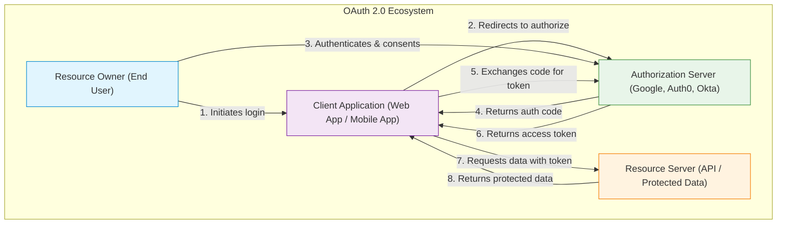

### Role Descriptions

| Role | Example | Responsibility |
|------|---------|---------------|
| **Resource Owner** | A Gmail user | Owns the data; grants/denies consent |
| **Client** | A task management app | Requests access; uses tokens to call APIs |
| **Authorization Server** | `accounts.google.com` | Authenticates user; issues/validates tokens |
| **Resource Server** | `www.googleapis.com` | Hosts protected resources; validates tokens on each request |

---

## 5. Tokens

### Access Token

- **Purpose:** Grants access to protected resources
- **Lifetime:** Short (typically 15 min – 1 hour)
- **Format:** Often a JWT (JSON Web Token) or opaque string

#### JWT Access Token Structure

```
Header.Payload.Signature
```

```json
// Header
{
  "alg": "RS256",
  "typ": "JWT",
  "kid": "abc123"
}

// Payload
{
  "iss": "https://auth.example.com",
  "sub": "user-12345",
  "aud": "https://api.example.com",
  "exp": 1719756000,
  "iat": 1719752400,
  "scope": "read:profile write:posts",
  "client_id": "my-web-app"
}

// Signature
RSASHA256(base64UrlEncode(header) + "." + base64UrlEncode(payload), privateKey)
```

### Refresh Token

- **Purpose:** Obtain a new access token without re-authenticating the user
- **Lifetime:** Long (days to months)
- **Storage:** Must be stored securely (never in browser `localStorage`)

### Token Lifecycle Diagram

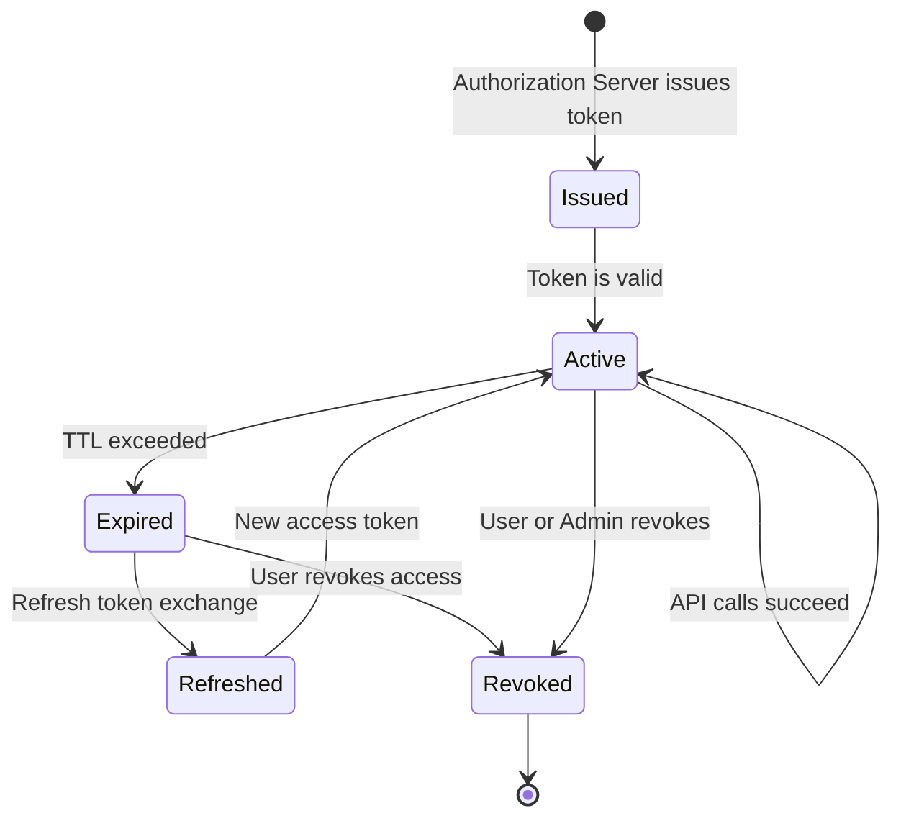

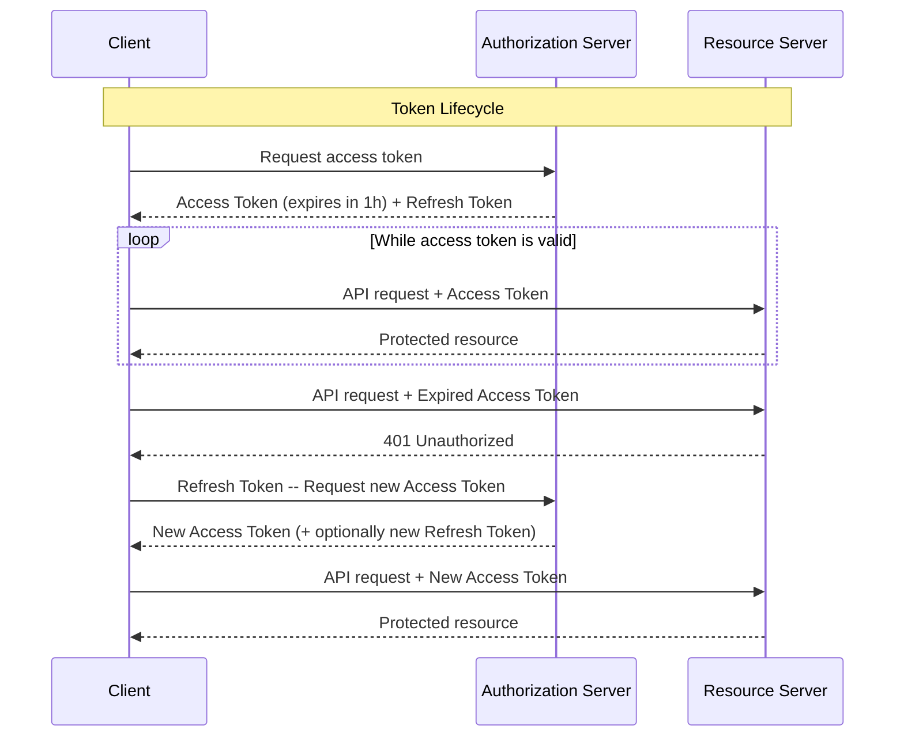

---

## 6. Grant Types

### 6.1 Authorization Code Grant

**Best for:** Server-side web applications with a backend.

This is the **most common and most secure** grant type for user-facing applications.

#### Sequence Diagram

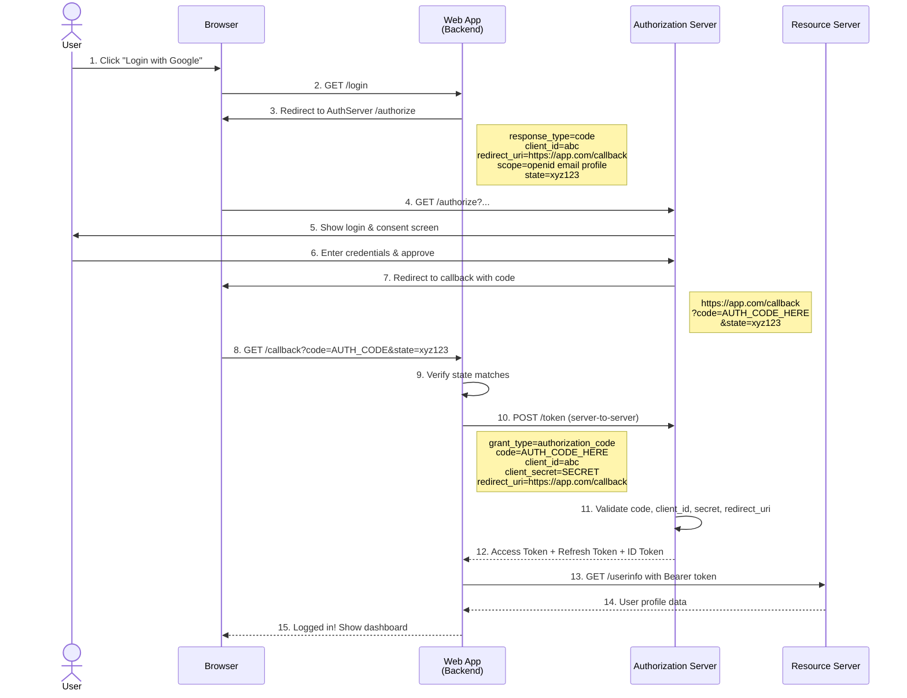

#### Code Example (Python / Flask)

```python
# app.py — OAuth 2.0 Authorization Code Flow with Google
import os
import requests
from flask import Flask, redirect, request, session, url_for

app = Flask(__name__)
app.secret_key = os.environ["FLASK_SECRET_KEY"]

# OAuth 2.0 Configuration
GOOGLE_CLIENT_ID     = os.environ["GOOGLE_CLIENT_ID"]
GOOGLE_CLIENT_SECRET = os.environ["GOOGLE_CLIENT_SECRET"]
REDIRECT_URI         = "http://localhost:5000/callback"
AUTH_URL              = "https://accounts.google.com/o/oauth2/v2/auth"
TOKEN_URL            = "https://oauth2.googleapis.com/token"
USERINFO_URL         = "https://www.googleapis.com/oauth2/v3/userinfo"


@app.route("/login")
def login():
    """Step 1: Redirect user to Google's authorization endpoint."""
    import secrets
    state = secrets.token_urlsafe(32)
    session["oauth_state"] = state

    params = {
        "client_id":     GOOGLE_CLIENT_ID,
        "redirect_uri":  REDIRECT_URI,
        "response_type": "code",
        "scope":         "openid email profile",
        "state":         state,
        "access_type":   "offline",       # request a refresh token
        "prompt":        "consent",       # force consent screen
    }
    auth_redirect = f"{AUTH_URL}?{'&'.join(f'{k}={v}' for k, v in params.items())}"
    return redirect(auth_redirect)


@app.route("/callback")
def callback():
    """Step 2: Handle the callback, exchange code for tokens."""
    # Verify state to prevent CSRF
    if request.args.get("state") != session.pop("oauth_state", None):
        return "State mismatch — possible CSRF attack", 403

    # Check for errors
    if "error" in request.args:
        return f"Authorization error: {request.args['error']}", 400

    # Exchange authorization code for tokens
    code = request.args["code"]
    token_response = requests.post(TOKEN_URL, data={
        "grant_type":    "authorization_code",
        "code":          code,
        "redirect_uri":  REDIRECT_URI,
        "client_id":     GOOGLE_CLIENT_ID,
        "client_secret": GOOGLE_CLIENT_SECRET,
    })
    tokens = token_response.json()

    if "error" in tokens:
        return f"Token error: {tokens['error_description']}", 400

    # Store tokens in session (use a secure store in production)
    session["access_token"]  = tokens["access_token"]
    session["refresh_token"] = tokens.get("refresh_token")

    # Fetch user profile
    headers = {"Authorization": f"Bearer {tokens['access_token']}"}
    user_info = requests.get(USERINFO_URL, headers=headers).json()

    return f"""
    <h1>Welcome, {user_info['name']}!</h1>
    <p>Email: {user_info['email']}</p>
    
    <br/><a href="/logout">Logout</a>
    """


@app.route("/logout")
def logout():
    session.clear()
    return redirect("/")


if __name__ == "__main__":
    app.run(debug=True, port=5000)
```

---

### 6.2 Authorization Code with PKCE

**Best for:** Single-page apps (SPAs), mobile apps, and native apps that **cannot securely store a client secret**.

PKCE (Proof Key for Code Exchange, pronounced "pixie") adds an extra layer of security by using a dynamically generated `code_verifier` and `code_challenge`.

#### Sequence Diagram

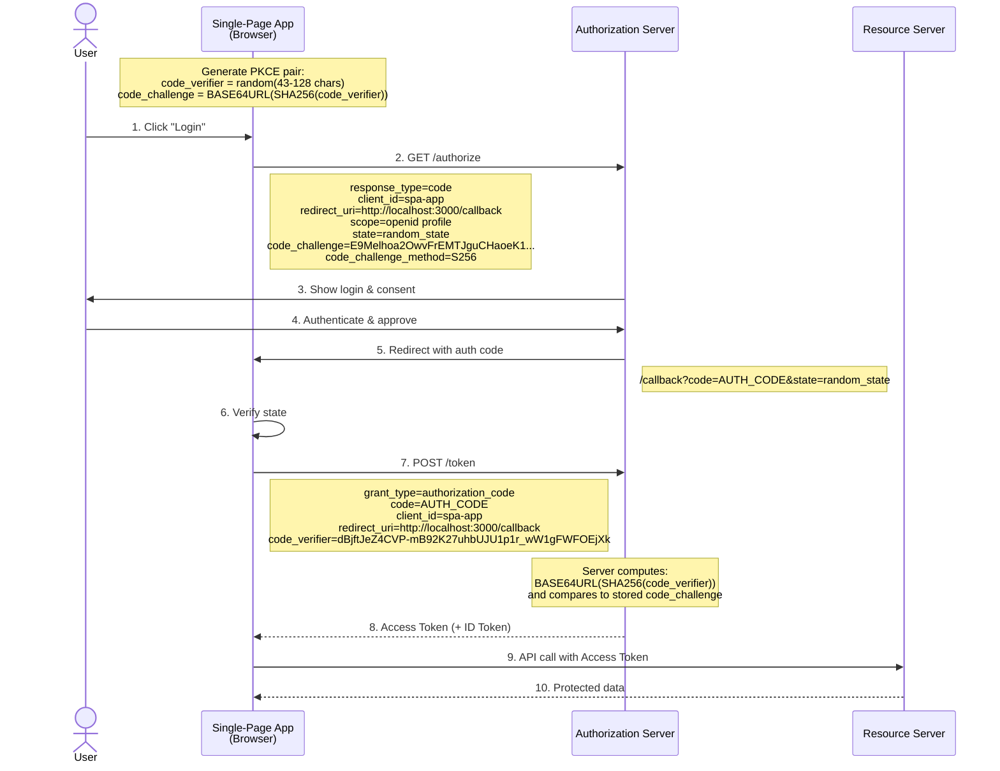

#### Code Example (JavaScript — SPA)

```javascript
// oauth-pkce.js — Authorization Code + PKCE for Single-Page Apps

// --- PKCE Helper Functions ---
function generateRandomString(length) {
  const charset = 'ABCDEFGHIJKLMNOPQRSTUVWXYZabcdefghijklmnopqrstuvwxyz0123456789-._~';
  const values = crypto.getRandomValues(new Uint8Array(length));
  return Array.from(values, v => charset[v % charset.length]).join('');
}

async function generateCodeChallenge(codeVerifier) {
  const encoder = new TextEncoder();
  const data = encoder.encode(codeVerifier);
  const digest = await crypto.subtle.digest('SHA-256', data);
  return btoa(String.fromCharCode(...new Uint8Array(digest)))
    .replace(/\+/g, '-')
    .replace(/\//g, '_')
    .replace(/=+$/, '');
}

// --- Configuration ---
const config = {
  clientId:     'your-spa-client-id',
  authUrl:      'https://auth.example.com/authorize',
  tokenUrl:     'https://auth.example.com/oauth/token',
  redirectUri:  'http://localhost:3000/callback',
  scope:        'openid profile email',
};

// --- Step 1: Initiate Login ---
async function login() {
  const codeVerifier  = generateRandomString(64);
  const codeChallenge = await generateCodeChallenge(codeVerifier);
  const state         = generateRandomString(32);

  // Store verifier and state for later verification
  sessionStorage.setItem('pkce_code_verifier', codeVerifier);
  sessionStorage.setItem('oauth_state', state);

  const params = new URLSearchParams({
    response_type:         'code',
    client_id:             config.clientId,
    redirect_uri:          config.redirectUri,
    scope:                 config.scope,
    state:                 state,
    code_challenge:        codeChallenge,
    code_challenge_method: 'S256',
  });

  window.location.href = `${config.authUrl}?${params}`;
}

// --- Step 2: Handle Callback ---
async function handleCallback() {
  const params       = new URLSearchParams(window.location.search);
  const code         = params.get('code');
  const returnedState = params.get('state');

  // Verify state
  if (returnedState !== sessionStorage.getItem('oauth_state')) {
    throw new Error('State mismatch — possible CSRF attack');
  }

  // Exchange code for token using the code_verifier
  const codeVerifier = sessionStorage.getItem('pkce_code_verifier');

  const response = await fetch(config.tokenUrl, {
    method: 'POST',
    headers: { 'Content-Type': 'application/x-www-form-urlencoded' },
    body: new URLSearchParams({
      grant_type:    'authorization_code',
      code:          code,
      redirect_uri:  config.redirectUri,
      client_id:     config.clientId,
      code_verifier: codeVerifier,
    }),
  });

  const tokens = await response.json();
  console.log('Access Token:', tokens.access_token);

  // Cleanup
  sessionStorage.removeItem('pkce_code_verifier');
  sessionStorage.removeItem('oauth_state');

  return tokens;
}
```

---

### 6.3 Client Credentials Grant

**Best for:** Machine-to-machine (M2M) communication where no user is involved (e.g., microservice-to-microservice, batch jobs, CI/CD pipelines).

#### Sequence Diagram

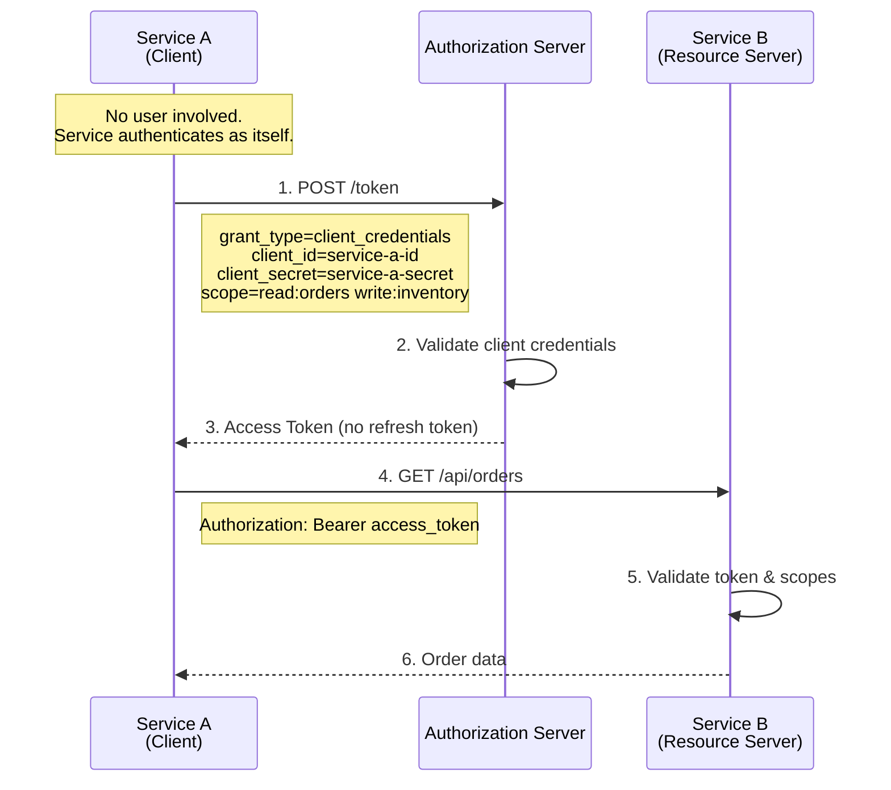

#### Code Example (Python)

```python
# m2m_client.py — Client Credentials Grant
import requests

TOKEN_URL = "https://auth.example.com/oauth/token"
API_URL   = "https://api.example.com"

CLIENT_ID     = "service-inventory-id"
CLIENT_SECRET = "service-inventory-secret"


def get_m2m_token():
    """Obtain an access token using client credentials."""
    response = requests.post(TOKEN_URL, data={
        "grant_type":    "client_credentials",
        "client_id":     CLIENT_ID,
        "client_secret": CLIENT_SECRET,
        "scope":         "read:orders write:inventory",
    })
    response.raise_for_status()
    return response.json()["access_token"]


def fetch_orders():
    """Call the Orders API with the M2M token."""
    token = get_m2m_token()
    headers = {"Authorization": f"Bearer {token}"}
    response = requests.get(f"{API_URL}/api/orders", headers=headers)
    response.raise_for_status()
    return response.json()


if __name__ == "__main__":
    orders = fetch_orders()
    print(f"Fetched {len(orders)} orders")
```

---

### 6.4 Device Authorization Grant

**Best for:** Input-constrained devices (Smart TVs, IoT devices, CLI tools) that cannot easily handle browser redirects.

#### Sequence Diagram

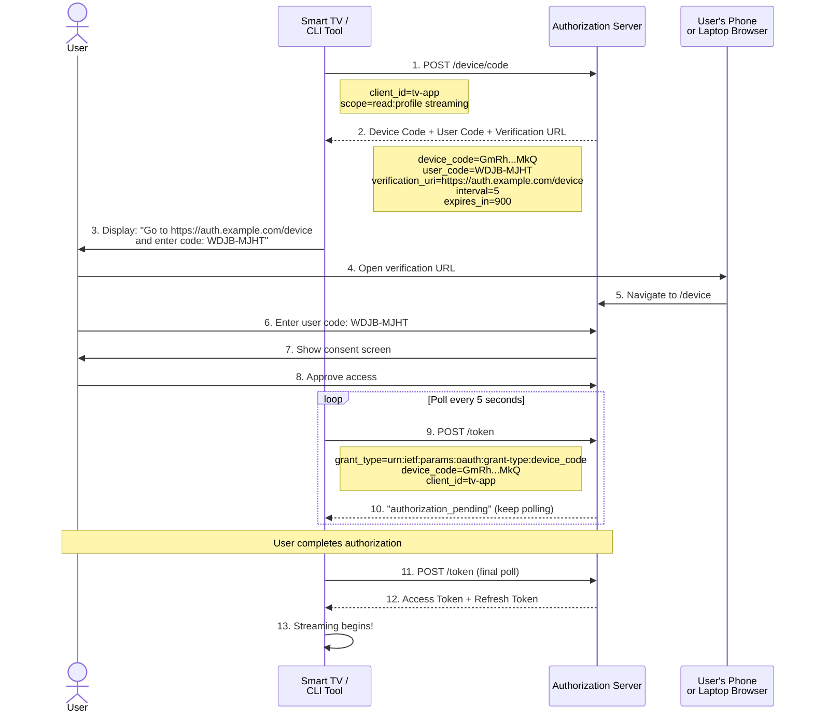

---

### 6.5 Refresh Token Grant

**Best for:** Maintaining long-lived sessions without re-prompting the user.

#### Sequence Diagram

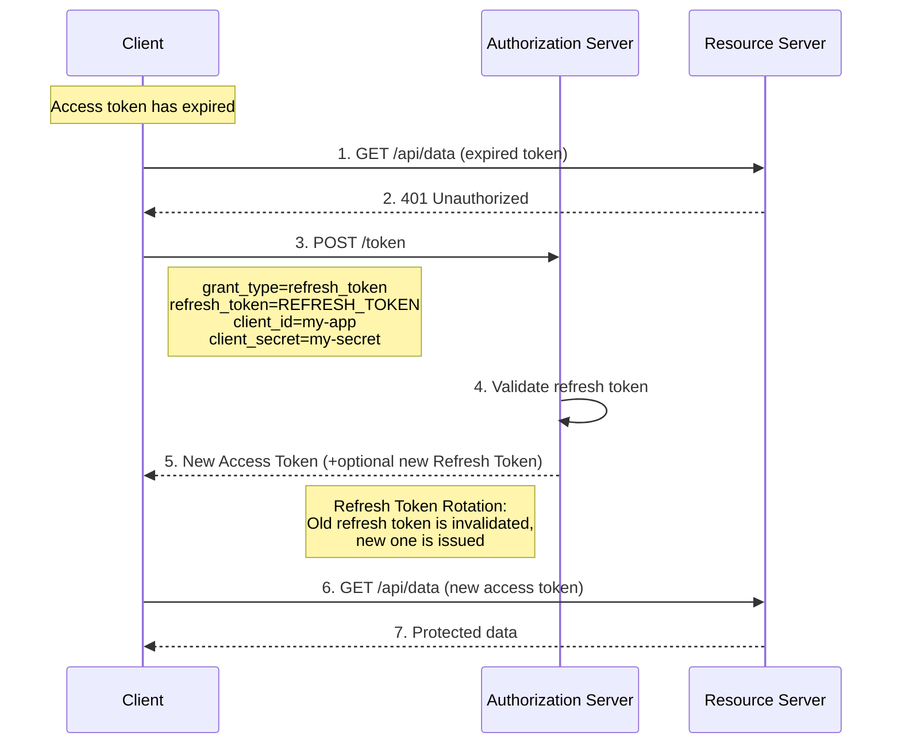

---

## 7. Scopes

Scopes define the **granularity of access** the client is requesting. They are space-delimited strings sent in the authorization request.

### Examples from Popular APIs

| Provider | Scope | Permission |
|----------|-------|------------|
| **Google** | `openid` | Authenticate the user (OIDC) |
| **Google** | `email` | View the user's email address |
| **Google** | `https://www.googleapis.com/auth/drive.readonly` | Read-only access to Google Drive |
| **GitHub** | `repo` | Full access to repositories |
| **GitHub** | `read:user` | Read user profile data |
| **GitHub** | `repo:status` | Read/write commit statuses |
| **Microsoft** | `User.Read` | Read user's basic profile |
| **Microsoft** | `Mail.Send` | Send mail on behalf of user |
| **Slack** | `channels:read` | View channels in a workspace |
| **Slack** | `chat:write` | Send messages to channels |

### Scope Hierarchy Diagram

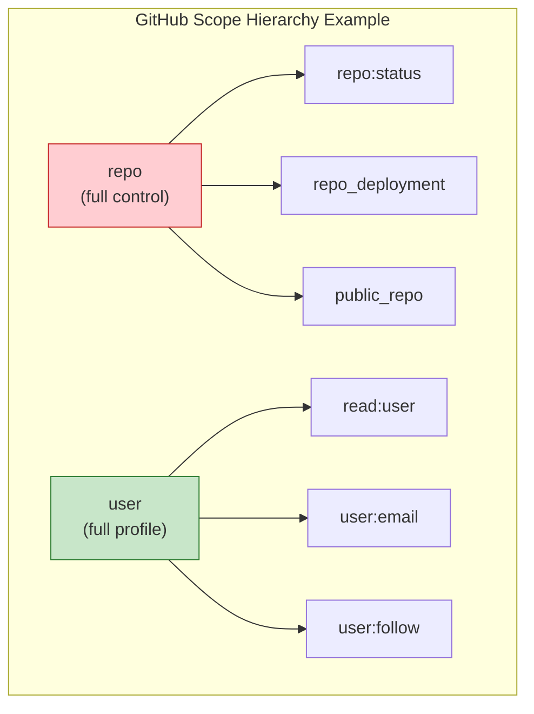

---

## 8. Real-World Example: "Login with Google"

This end-to-end example shows how a task management app ("TaskFlow") implements Google login.

### Architecture Overview

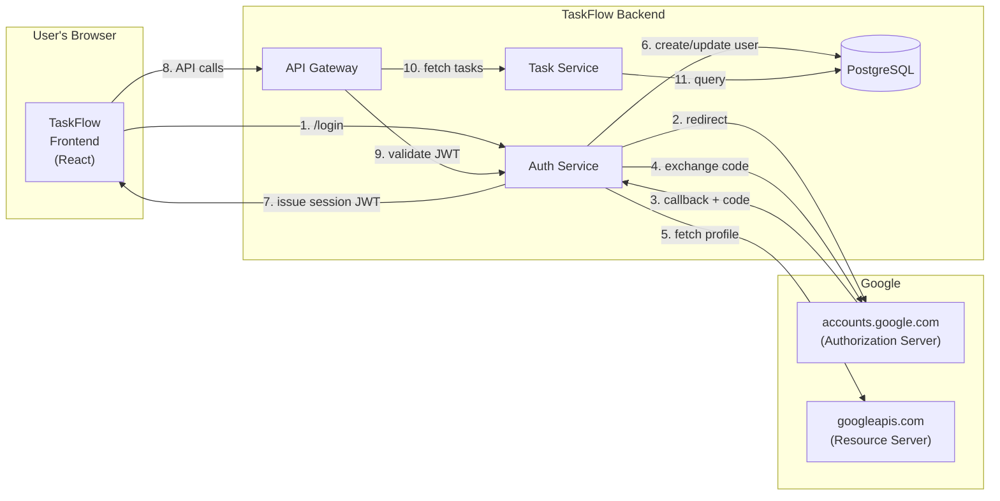

### Complete Flow — Step by Step

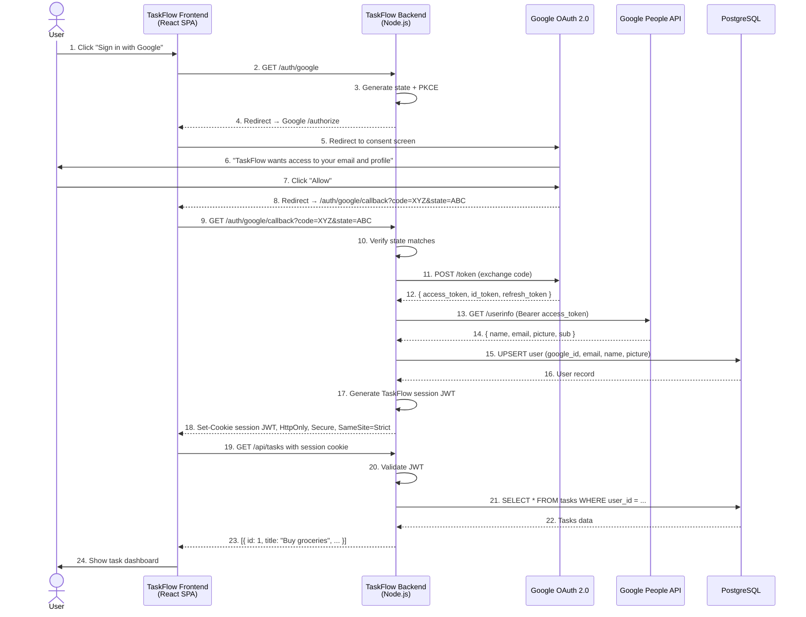

---

## 9. Real-World Example: Machine-to-Machine API Access

### Scenario: Nightly Inventory Sync Between Microservices

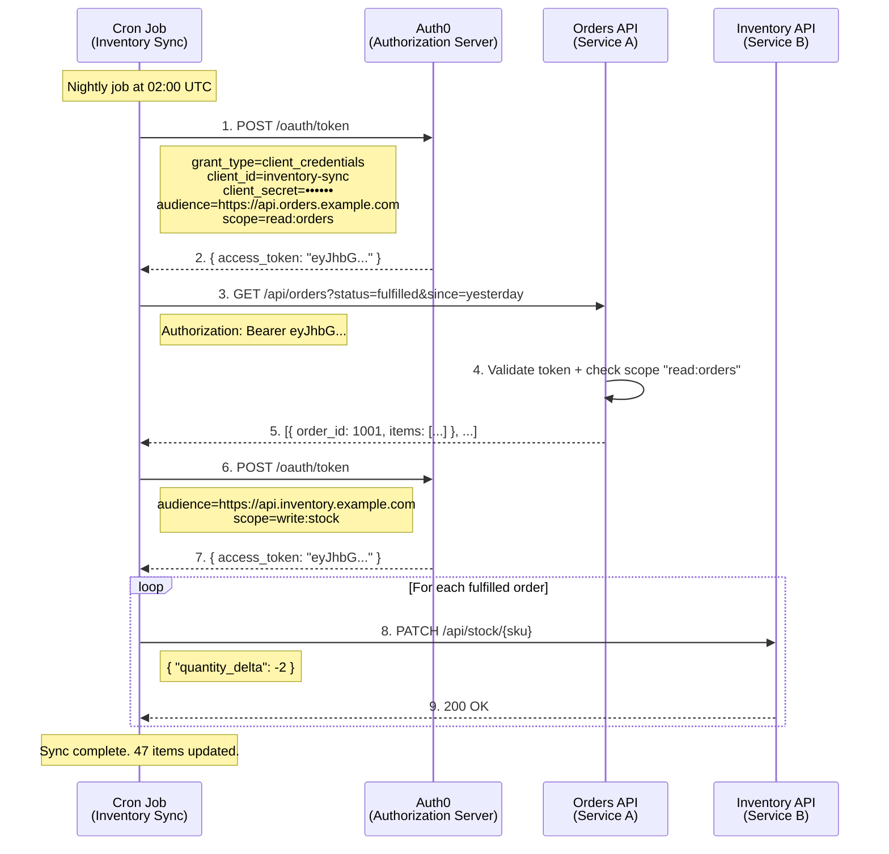

---

## 10. Security Best Practices

### Token Storage Decision Matrix

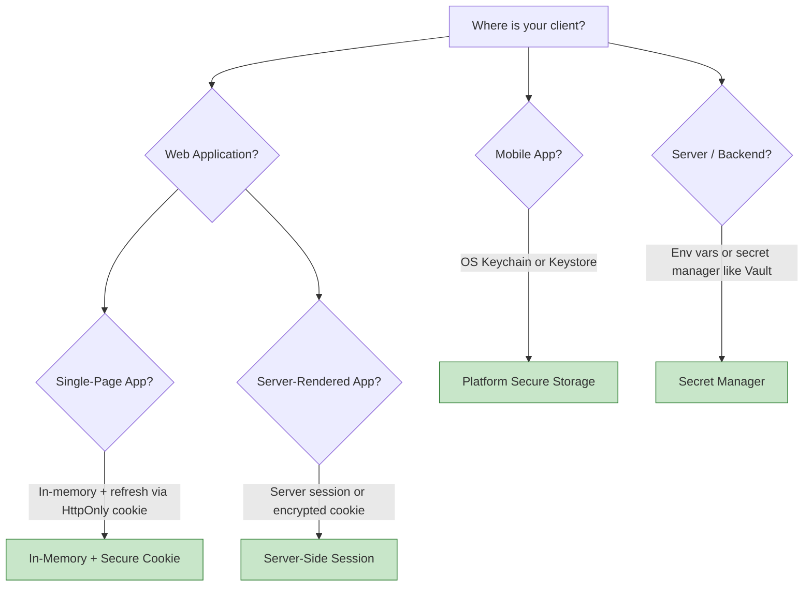

### Security Checklist

| Practice | Description |
|----------|-------------|
| **Always use HTTPS** | Never transmit tokens over plain HTTP |
| **Use PKCE** | Required for public clients (SPAs, mobile); recommended for all |
| **Validate `state` parameter** | Prevents CSRF attacks on the redirect URI |
| **Short token lifetimes** | Access tokens: 15–60 minutes; refresh tokens: days with rotation |
| **Refresh token rotation** | Issue a new refresh token on each use; invalidate the old one |
| **Validate redirect URIs** | Exact match only — no wildcards in production |
| **Use `HttpOnly` + `Secure` + `SameSite` cookies** | For storing tokens in web applications |
| **Never store tokens in `localStorage`** | Vulnerable to XSS attacks |
| **Validate JWT claims** | Always check `iss`, `aud`, `exp`, `nbf` |
| **Use `aud` claim** | Prevents token confusion between different APIs |
| **Implement token revocation** | Support RFC 7009 for immediate access removal |
| **Principle of least privilege** | Request only the scopes you actually need |

### Threat Model — Common Attack Vectors

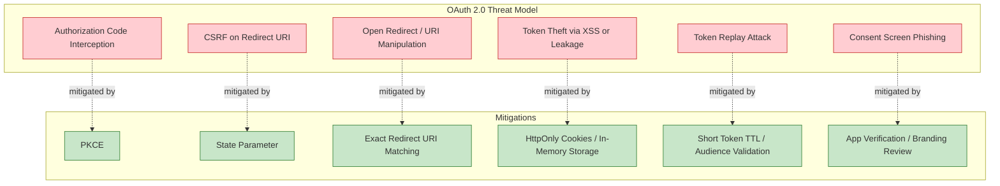

---

## 11. Common Pitfalls

| Pitfall | Why It's Bad | What to Do Instead |
|---------|-------------|-------------------|
| Using the **Implicit Grant** | Tokens exposed in URL fragment; deprecated in OAuth 2.1 | Use Authorization Code + PKCE |
| Storing tokens in **`localStorage`** | Vulnerable to XSS attacks | Use `HttpOnly` cookies or in-memory |
| **Not validating `state`** | Allows CSRF attacks | Always generate, store, and verify `state` |
| **Long-lived access tokens** | Larger blast radius if compromised | Use short TTLs (15–60 min) with refresh tokens |
| **Overly broad scopes** | Violates least privilege | Request only what you need |
| **Hardcoding `client_secret`** in frontend code | Secret is extractable from JS bundles | Use PKCE for public clients; secrets only on backends |
| **Not using HTTPS** | Tokens intercepted via MITM | HTTPS is mandatory for all OAuth endpoints |
| **Ignoring token expiration** | 401 errors frustrate users | Implement silent refresh with refresh tokens |
| **No token revocation** | Users can't revoke access | Implement RFC 7009 revocation endpoint |

---

## 12. OAuth 2.0 vs OAuth 1.0 vs OpenID Connect

### Comparison Diagram

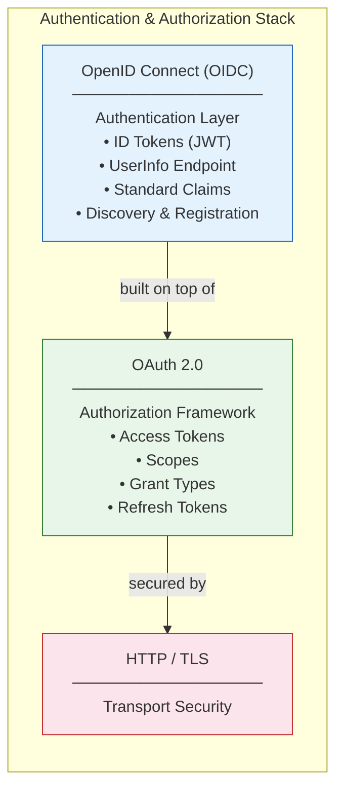

### Feature Comparison

| Feature | OAuth 1.0 | OAuth 2.0 | OpenID Connect |
|---------|-----------|-----------|----------------|
| **Purpose** | Authorization | Authorization | Authentication + Authorization |
| **Token format** | Custom signed tokens | Bearer tokens (JWT/opaque) | JWT (ID Token) |
| **Transport security** | Signature-based | TLS/HTTPS required | TLS/HTTPS required |
| **Complexity** | High (crypto signatures) | Low (bearer tokens) | Medium (JWT validation) |
| **Mobile support** | Poor | Excellent | Excellent |
| **Token types** | Request + Access | Access + Refresh | Access + Refresh + ID |
| **User identity** | Not standardized | Not standardized | Standardized (claims) |
| **Discovery** | No | No | Yes (`/.well-known/openid-configuration`) |
| **Status** | Legacy | Current (RFC 6749) | Current (built on OAuth 2.0) |

---

## 13. References

| Resource | URL |
|----------|-----|
| **RFC 6749** — OAuth 2.0 Framework | https://datatracker.ietf.org/doc/html/rfc6749 |
| **RFC 7636** — PKCE | https://datatracker.ietf.org/doc/html/rfc7636 |
| **RFC 7009** — Token Revocation | https://datatracker.ietf.org/doc/html/rfc7009 |
| **RFC 8628** — Device Authorization Grant | https://datatracker.ietf.org/doc/html/rfc8628 |
| **OAuth 2.1 Draft** | https://datatracker.ietf.org/doc/html/draft-ietf-oauth-v2-1-07 |
| **OpenID Connect Core** | https://openid.net/specs/openid-connect-core-1_0.html |
| **OAuth.net** — Community Resources | https://oauth.net/2/ |
| **Auth0 Docs** — OAuth 2.0 | https://auth0.com/docs/authenticate/protocols/oauth |
| **Google OAuth 2.0 Playground** | https://developers.google.com/oauthplayground/ |

---

> **Last Updated:** June 2026
> **License:** This tutorial is provided for educational purposes.
